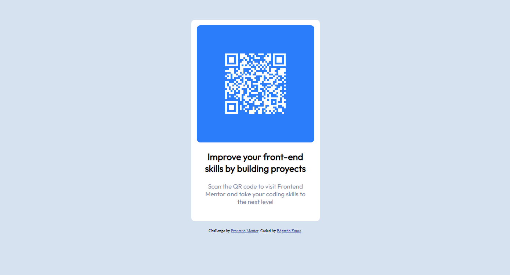

# Frontend Mentor - QR code component solution

This is a solution to the [QR code component challenge on Frontend Mentor](https://www.frontendmentor.io/challenges/qr-code-component-iux_sIO_H). Frontend Mentor challenges help you improve your coding skills by building realistic projects. 

## Table of contents

- [Overview](#overview)
  - [Screenshot](#screenshot)
  - [Links](#links)
- [My process](#my-process)
  - [Built with](#built-with)
  - [What I learned](#what-i-learned)
  - [Continued development](#continued-development)
  - [Useful resources](#useful-resources)
- [Author](#author)
- [Acknowledgments](#acknowledgments)

**Note: Delete this note and update the table of contents based on what sections you keep.**

## Overview

### Screenshot



### Links

- Solution URL: [Github](https://github.com/Ednesor/qr-code-component-main)
- Live Site URL: [Deploy](https://ednesor.github.io/qr-code-component-main/)

## My process

### Built with

- CSS
- Flexbox
- Mobile-first workflow

### What I learned

I learned to create QR codes and implement them on a web page, reinforce basic knowledge about HTML, CSS and Javascript and adapt the project to what the client requests.

The most important thing was to learn how to create the QR code from an open source library.

```html
<script src="https://unpkg.com/qrious@4.0.2/dist/qrious.js"></script>
```
```js
new QRious({
      element: document.querySelector("#qrcode"),
      value: "https://www.frontendmentor.io/home",
      size: 170,
      backgroundAlpha: 0,
      foreground: "hsl(0, 0%, 100%)",
      level: "H",
    });
```

### Continued development

I would like to port the component to React, using styled components to have it available whenever I want by changing only the destination link.

### Useful resources

- [Guide](https://parzibyte.me/blog/2021/06/26/generar-codigos-qr-javascript/) - This page helped me discover and understand how this library works.

## Author

- Website - [Edgardo Funes](https://portfolio-ednesor.vercel.app)
- Frontend Mentor - [@Ednesor](https://www.frontendmentor.io/profile/Ednesor)

